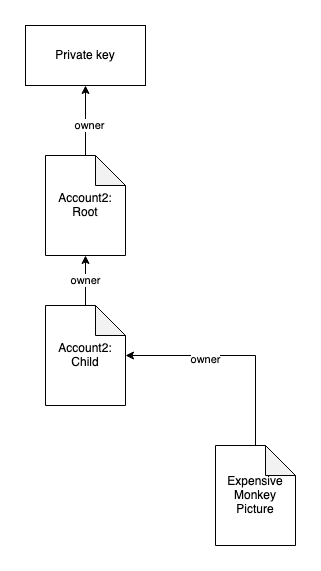
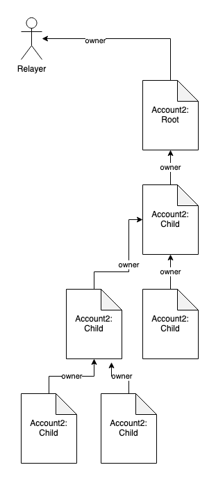
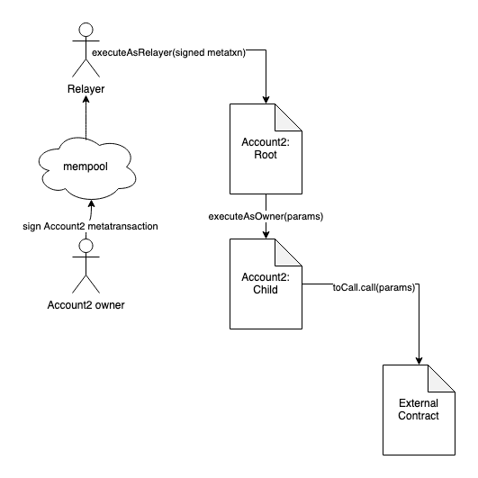

# Account2
## Account Abstraction & Economic Abstraction for Ethereum

### Overview
`Account2` is a contract designed to accomplish three key features not yet enshrined in the Ethereum protocol.

`Account Abstraction` the ability to have an account that will allow a relayer to act on behalf of the account owner as `msg.sender`. This will solve three major UX challenges experienced in the first allowing all transactions to be bundled in a single transaction (i.e.: the necessity for an approve transaction before a swap transaction). Next it will allow a relayer to sponsor the gas for a transaction which is a major UX hurdle for Ethereum adoption. Lastly, a controlling key that has been compromised can be replaced in a single transaction transfering all the asset held in the `Account2` account.

`Economic Abstraction` the ability to pay an Ethereum transaction gas fee in any ERC20 token. Economic abstraction allows the user to pay for transaction in any ERC20 they hold in their `Account2`.

`Account Linking` the ability to associate accounts heirachically with a single private key. Since the `owner` of an account can be a contract we set the owner to a root `Account2` and all requests will begin in the root `Account2` and will be forwarded to subordinate `Account2` accounts. Using singly linked design we can establish any level of heirarchy with minimum overhead for each hop.

## Account Abstraction

As described above `Account Abstraction` using `Account2` allows the user to link multiple wallets and reassign ownership to create the desired structure.



A more complex example of how account heirarchical linking works in `Account2` can be seen in the following diagram



Using `Account2` each `Account2` can be called from the owner requiring only a single transactino from the root `Account2`. Each subsequent call is passed to the child from the `owner` where the `msg.sender` is the `owner` without the need to validate a signature. An example of the above described transaction can be seen in the following diagram.



## Economic Abstraction
`Economic Abstraction` in our design the `Account2` owner can specify the value necessary for abstracted gas payment in the signed metatransaction using the following values:

`gasToken` - an `address` for the desired ERC20 to make the transaction payment

`gasTokenRatio` - a `uint256` wad `1e18` value that represent the ratio of `gas` to `gasToken` amount. For instance if the underlying `gasToken` is $AAVE the owner wants to pay 1 $AAVE per 1 gas they would use the following formula `1/1e18` (actual ratio math should account for precision)

`gasLimit` - a `uint256` value that limits the amount of gas a relayer can spend when calling the transaction

After the completion of a transaction using the `executeAsRelayer` method in the `Account2` contract the amount of gas used for the transaction is calculated using the following formula and transfered to the `tx.origin`.
```
uint256 amountToTransfer = (gasUsed + 21000) * gasTokenRatio;
```

## Limitations of the design
Allowances and gas costs are the two main drawbacks to the current design. Allowances are instances where tokens owned by the `Account2` contract are not reset when a transfer occurs. This is only an issue in instances where the owner transfers ownership to another owner as part of a sale.

Gas costs can be reduced through golfing of the contracts but still carry some overhead. An alternative might be to enshrine `Account2` in protocol to have effectively zero gas cost to initiate a transaction.

---

## Getting Started

**Setup**
```bash
forge install
```

**Building**
```bash
forge build
```

**Testing**
```bash
forge test
```

**Deployment & Verification**

Inside the [`utils/`](./utils/) directory are a few preconfigured scripts that can be used to deploy and verify contracts.

Scripts take inputs from the cli, using silent mode to hide any sensitive information.

_NOTE: These scripts are required to be _executable_ meaning they must be made executable by running `chmod +x ./utils/*`._

_NOTE: these scripts will prompt you for the contract name and deployed addresses (when verifying). Also, they use the `-i` flag on `forge` to ask for your private key for deployment. This uses silent mode which keeps your private key from being printed to the console (and visible in logs)._


### First time with Forge/Foundry?

See the official Foundry installation [instructions](https://github.com/foundry-rs/foundry/blob/master/README.md#installation).

Then, install the [foundry](https://github.com/foundry-rs/foundry) toolchain installer (`foundryup`) with:
```bash
curl -L https://foundry.paradigm.xyz | bash
```

Now that you've installed the `foundryup` binary,
anytime you need to get the latest `forge` or `cast` binaries,
you can run `foundryup`.

So, simply execute:
```bash
foundryup
```

🎉 Foundry is installed! 🎉


### Writing Tests with Foundry

With [Foundry](https://github.com/foundry-rs/foundry), all tests are written in Solidity! 🥳

Create a test file for your contract in the `test/` directory.

For example, [`src/Greeter.sol`](./src/Greeter.sol) has its test file defined in [`./test/Greeter.t.sol`](./test/Greeter.t.sol).

To learn more about writing tests in Solidity for Foundry, reference Rari Capital's [solmate](https://github.com/Rari-Capital/solmate/tree/main/src/test) repository created by [@transmissions11](https://twitter.com/transmissions11).


### Configure Foundry

Using [foundry.toml](./foundry.toml), Foundry is easily configurable.

For a full list of configuration options, see the Foundry [configuration documentation](https://github.com/foundry-rs/foundry/blob/master/config/README.md#all-options).


## License

[AGPL-3.0-only](https://github.com/abigger87/femplate/blob/master/LICENSE)


## Acknowledgements

- [femplate](https://github.com/abigger87/femplate)
- [foundry](https://github.com/foundry-rs/foundry)
- [solmate](https://github.com/Rari-Capital/solmate)
- [forge-std](https://github.com/brockelmore/forge-std)
- [forge-template](https://github.com/foundry-rs/forge-template)
- [foundry-toolchain](https://github.com/foundry-rs/foundry-toolchain)


## Disclaimer

_These smart contracts are being provided as is. No guarantee, representation or warranty is being made, express or implied, as to the safety or correctness of the user interface or the smart contracts. They have not been audited and as such there can be no assurance they will work as intended, and users may experience delays, failures, errors, omissions, loss of transmitted information or loss of funds. The creators are not liable for any of the foregoing. Users should proceed with caution and use at their own risk._
